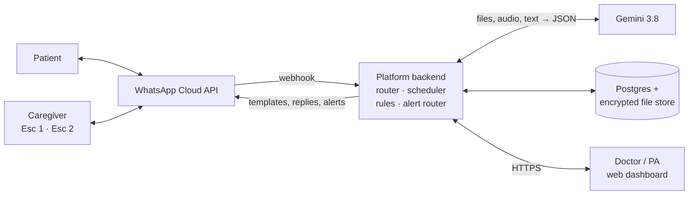
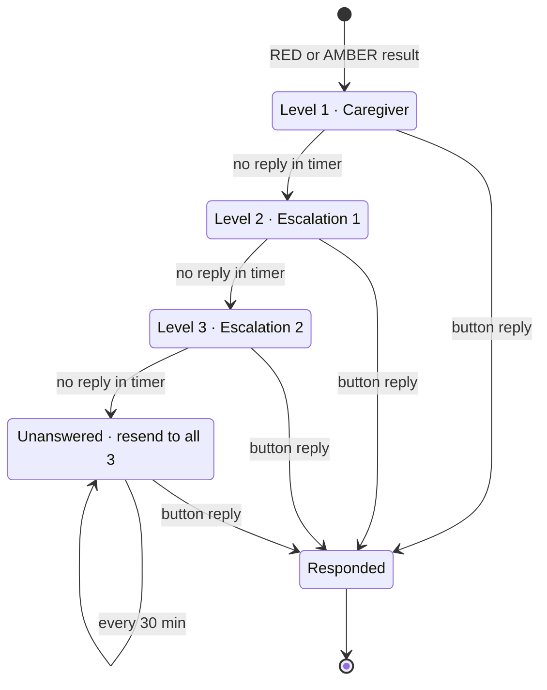

# RemoteCare PRD

Sep 25, 2026 · @Biocliq

Living version: https://claude.ai/code/artifact/b0fbcece-811a-4499-b665-4d59549ca841

## Overview

RemoteCare lets a doctor monitor patients at home between visits. Patients and their family send readings over WhatsApp, and the doctor reviews trends in a web dashboard. The first release targets chronic-care patients whose doctors need daily home data (for example weight, blood pressure, fluid balance, blood sugar).

**Problem.** Between hospital visits, doctors see almost nothing of how a patient is doing. Warning signs such as fluid build-up or missed medicines are found late, often at the next visit or in an emergency. Families collect readings on paper or in chat threads that nobody analyses.

**Product.** Patients and care contacts use only WhatsApp: forms, buttons, photos, PDFs and voice notes. Gemini 3.8 reads documents, photos and voice notes and turns them into structured data. A rules engine checks each reading against the doctor's thresholds and alerts the family through a three-level escalation chain. Doctors and physician assistants (PAs) use a web dashboard for trends, exceptions and plan changes.

**Goals**

- Capture the home readings each doctor prescribes, every day, with little effort from the family.
- Turn prescriptions and lab reports into structured tables without manual typing.
- Make sure every out-of-range reading reaches a responsible family member who acknowledges it.
- Give the doctor a complete, colour-coded view of the patient before every review.

**Non-goals for the first release**

- No alerts or notifications to the doctor or PA. All alerts go to the family escalation chain.
- No diagnosis or treatment advice from AI. AI reads, extracts and summarises only.
- No video consultation, e-prescribing, pharmacy ordering or billing.
- Not an emergency service.

## Users and roles

Six roles use the product. Every patient must have a caregiver and two escalation contacts before monitoring starts.

| Role | Channel | What they do | What they can see |
| --- | --- | --- | --- |
| Doctor | Web dashboard | Takes on patients, sets monitoring plans, thresholds and lab tests, reviews trends, changes the plan | All data for their patients |
| Physician assistant (PA) | Web dashboard | Checks AI-extracted medicines and labs, records vitals at visits | All data for their doctor's patients |
| Patient | WhatsApp | Completes profile, uploads documents, logs readings, receives advice | Their own plan, readings and messages |
| Caregiver (level 1) | WhatsApp | Logs readings for the patient, receives alerts first | Readings they logged, alerts, doctor's advice |
| Escalation 1 (level 2) | WhatsApp | Receives an alert if the caregiver does not respond in time | Alerts sent to them |
| Escalation 2 (level 3) | WhatsApp | Receives an alert if Escalation 1 does not respond in time | Alerts sent to them |

Family physician and nearby pharmacy are stored as contact details on the patient profile. They are not users in the first release.

## Channels and architecture

WhatsApp is the only interface for patients and care contacts, and the web dashboard is the only interface for clinicians. Gemini 3.8 is called only by the backend.

The backend receives every WhatsApp message as a webhook, calls Gemini when it needs to read a file or audio, validates and saves the result, and runs the rules. Alerts leave only through WhatsApp, to care contacts.

**WhatsApp constraints the design follows**

- Free-form and interactive messages are allowed only within 24 hours of the person's last message.
- Reminders, alerts and opt-in invites are template messages, approved by Meta in advance, one per language.
- Every contact must opt in before the platform messages them.
- Media links expire, so files are downloaded on arrival and stored encrypted.

The [workflow diagrams](workflows.html) show each workflow step by step.

## Functional requirements

Requirements are grouped by the five workflows in the source document. P0 is required for the first release, P1 follows soon after.

### Workflow 1: Doctor onboarding

| ID | Requirement | Acceptance criteria | Priority |
| --- | --- | --- | --- |
| DR-1 | Doctor signs up on the web and creates a profile: name, qualification, discipline, working days and hours, emergency contact | Profile saves; registration number is stored and checked by an admin before the account can take on patients | P0 |
| DR-2 | Doctor invites one or more PAs by email | PA gets a login that sees only that doctor's patients | P0 |
| DR-3 | Doctor sees a patient pool and selects patients to manage | Selected patients get a WhatsApp opt-in template; the patient is linked only after they tap Accept | P0 |
| DR-4 | Consent is recorded | Timestamp, phone number and template text shown are stored and cannot be edited | P0 |

### Workflow 2: Patient onboarding

| ID | Requirement | Acceptance criteria | Priority |
| --- | --- | --- | --- |
| PT-1 | Patient completes a profile through a WhatsApp Flow form: name, phone, birth month and year, address, treating doctor, family physician, nearby pharmacy | All required fields validated in the form; profile visible in the dashboard | P0 |
| PT-2 | Patient adds a caregiver, Escalation 1 and Escalation 2: name, phone, relationship, availability | Three different numbers, none the patient's own; each gets an opt-in template naming their level | P0 |
| PT-3 | Monitoring starts only when all three contacts have accepted | A decline asks the patient for a replacement; the dashboard shows which contacts are pending | P0 |
| PT-4 | Patient uploads current prescriptions as photos or PDFs | Files stored encrypted; Gemini returns a medication table; patient confirms it on WhatsApp | P0 |
| PT-5 | Patient uploads lab reports from the last six months | Gemini returns a lab table with marker, value, unit, date and reference range | P0 |
| PT-6 | PA or doctor reviews extracted tables next to the original file | Low-confidence fields highlighted; nothing is used for alerts until approved | P0 |
| PT-7 | Doctor sets key markers and thresholds per patient | Each threshold has a parameter, limit, direction or rate of change, and RED or AMBER level | P0 |
| PT-8 | Patient can replace a care contact at any time | The old contact stays active until the new one accepts | P1 |

### Workflow 3: Home monitoring

| ID | Requirement | Acceptance criteria | Priority |
| --- | --- | --- | --- |
| HM-1 | Doctor selects home parameters and frequency: fluid in/out, swelling, weight, sleep, bowel movement, urination frequency, fasting and post-meal sugar, blood pressure, medicine adherence | Plan saved per patient; the patient and caregiver receive a plain-language summary | P0 |
| HM-2 | Doctor prescribes lab tests with a due date | Test appears in the patient's schedule | P0 |
| HM-3 | End-of-day reminder to the patient and caregiver | Template sent at a time set per patient; opens a Flow form listing only today's parameters | P0 |
| HM-4 | Readings can be sent as a form, free text, voice note or photo of a device display | Anything that is not a form is echoed back with [Yes] / [Edit] before saving | P0 |
| HM-5 | Medicine adherence logged per scheduled dose | [Taken] / [Missed] buttons per dose; missed doses feed the trend rules | P0 |
| HM-6 | Missed daily log is followed up | No log within 2 hours of the reminder → one nudge; still none → marked missed | P0 |
| HM-7 | Lab test reminders | Templates sent 2 days and 1 day before the due date | P0 |
| HM-8 | Patient uploads a lab report after a test | Extracted, confirmed and added to lab history like PT-5 | P0 |
| HM-9 | Symptoms reported with an optional photo or voice note | Stored with a transcript and tags; the original is kept | P1 |

### Workflow 4: Insights

| ID | Requirement | Acceptance criteria | Priority |
| --- | --- | --- | --- |
| IN-1 | Every saved reading or lab value is checked against the patient's thresholds | Check completes within 1 minute of saving; result is RED, AMBER or GREEN | P0 |
| IN-2 | Trend rules: rate of change, consecutive missed doses, missing days | Rules configurable per patient, e.g. weight up 2 kg in 3 days | P0 |
| IN-3 | Trend charts for every home parameter and lab marker | Charts cover any date range; thresholds drawn on the chart | P0 |
| IN-4 | Weekly AI summary per patient | Shown on the patient page with the data it was based on | P1 |

Alerting is specified separately under Alerts and escalation.

### Workflow 5: Doctor intervention

| ID | Requirement | Acceptance criteria | Priority |
| --- | --- | --- | --- |
| DI-1 | Patient page shows trends of all lab markers and home parameters | Loads in under 3 seconds for 12 months of data | P0 |
| DI-2 | Exceptions colour-coded RAG with a text label | Readable without colour ("High", "Watch", "OK") | P0 |
| DI-3 | Medicine non-adherence shown per medicine | Missed doses by day for the selected period | P0 |
| DI-4 | Symptom log with photos | Chronological, with original media | P0 |
| DI-5 | Alert history: every alert, the level it reached, who responded and how | Matches the alert log exactly | P0 |
| DI-6 | PA records vitals during a visit | Saved as clinic readings, shown apart from home readings | P0 |
| DI-7 | Doctor updates medicines, parameters, tests and thresholds | Changes apply to the next reminder cycle; history of changes kept | P0 |
| DI-8 | Doctor's advice sent to the patient over WhatsApp | Optional AI rewrite in plain language and the patient's language; doctor approves before sending | P1 |
| DI-9 | AI pre-visit brief | One page, with links to the source data | P1 |

## Alerts and escalation

Every RED or AMBER result starts a three-level escalation chain on WhatsApp: caregiver, then Escalation 1, then Escalation 2. The doctor and PA are never notified; they see alerts in the dashboard at the next review.

The chain moves down a level whenever the timer runs out and stops at the first button reply.

| ID | Requirement | Acceptance criteria | Priority |
| --- | --- | --- | --- |
| AL-1 | Alert content | Parameter, value, limit, 7-day trend, doctor's clinic number, "not an emergency service" line and the local emergency number | P0 |
| AL-2 | Level timers | Defaults RED 15 min and AMBER 60 min per level; the doctor can change them per patient | P0 |
| AL-3 | Escalation messages | Level 2 says the caregiver has not responded; level 3 lists who was already tried | P0 |
| AL-4 | What stops the chain | Only a button reply: [Contacted doctor], [Will monitor] or [Need help]. Read receipts do not count | P0 |
| AL-5 | Others are told who responded | Everyone already alerted gets "&lt;name&gt; has responded" | P0 |
| AL-6 | Nobody responds | Alert marked unanswered and resent to all three every 30 min until someone replies | P0 |
| AL-7 | Same parameter alerts again while a chain is open | No new chain; the open alert is updated with the new value | P0 |
| AL-8 | Alert log | Stores trigger, rule, every message sent, delivery status, levels reached, responder, reply and times | P0 |
| AL-9 | Routing lives in one alert router | Adding doctor or PA recipients later is a configuration change | P0 |
| AL-10 | Quiet hours for AMBER alerts | Per-patient window during which AMBER alerts wait until morning | P1 |

## AI requirements (Gemini 3.8)

Gemini 3.8 handles all reading, extraction, transcription and summarising. It never decides alerts and never gives clinical advice on its own.

| Task | Input | Output | Guardrail |
| --- | --- | --- | --- |
| Medication extraction | Prescription photo or PDF, voice note | Medicine, strength, dose, frequency, route, start date | Schema check; patient confirms; PA approves |
| Lab extraction | Lab report photo or PDF | Marker, value, unit, date, reference range, lab name | Units normalised; low-confidence fields flagged |
| Reading capture | Free text, voice note, device photo | Parameter, value, unit, time | Echoed back for [Yes] / [Edit] |
| Symptom notes | Voice note, photo | Transcript, symptom tags | Original kept and shown unedited |
| Summaries | Stored readings, labs, adherence, alerts | Weekly summary, pre-visit brief | Cites source data; never triggers alerts |
| Patient messages | Doctor's advice | Plain-language, translated text | Doctor approves before sending |

**Rules for every AI call**

- Called only by the backend. The API key is stored in a secrets manager, never in client code.
- Output is structured JSON validated against a fixed schema. Invalid output is retried once, then sent to the PA review queue.
- Every field carries a confidence score. Fields below the threshold are highlighted for review.
- Each call is logged with the prompt version, model version, input file ID and output, so any value can be traced.
- Voice notes are supported in the languages chosen for launch (to be decided).

## Non-functional requirements

Health data, alert reliability and traceability set most of the non-functional bar.

| Area | Requirement |
| --- | --- |
| Privacy and compliance | Meets the health-data law where the product launches (for example DPDP in India, HIPAA in the US). Gemini use under terms that allow health data, with a data region and retention setting to match |
| Encryption | TLS in transit; database and file store encrypted at rest; files are never sent to WhatsApp or Gemini by public link |
| Access control | Role-based: a doctor and their PAs see only their own patients; care contacts see only what is sent to them |
| Audit log | Every view and change of patient data by a clinician, every consent and every alert message is logged and cannot be edited |
| Alert reliability | A result is checked and the first alert sent within 2 minutes of the reading being saved; alert jobs survive restarts |
| Availability | 99.5% monthly for message intake and alerting |
| WhatsApp delivery | Failed sends retried; a failed alert moves to the next level at once instead of waiting for the timer |
| Data retention | Retention period set per the applicable medical-records law; the patient can request an export |
| Accessibility | Dashboard meets WCAG 2.1 AA; WhatsApp messages written for low literacy, with voice notes as input |
| Scale for launch | 50 doctors, 2,000 patients, about 20,000 inbound messages a day |

## Data model

The core entities are listed below. Every clinical value links back to its source (a message, a file or a clinician entry).

| Entity | Key fields |
| --- | --- |
| Doctor | Name, qualification, discipline, registration number, working hours, emergency contact, clinic number |
| PA | Name, email, linked doctor |
| Patient | Name, phone, birth month and year, address, family physician, pharmacy, status (onboarding, active, paused) |
| CareContact | Patient, level (1–3), name, phone, relationship, availability, opt-in status and time |
| Consent | Person, phone, template shown, accepted or declined, time |
| Document | Patient, type (prescription, lab report, symptom photo, voice note), encrypted file, extraction status |
| Medication | Patient, name, strength, dose, frequency, route, start and end date, source document, approved by |
| LabResult | Patient, marker, value, unit, date, reference range, source document, approved by |
| MonitoringPlan | Patient, parameter, frequency, reminder time |
| Threshold | Patient, parameter, rule (limit or rate of change), level (RED or AMBER), level timers |
| Reading | Patient, parameter, value, unit, time, entered by, input type (form, text, voice, photo), source message |
| DoseLog | Patient, medication, scheduled time, taken or missed |
| LabOrder | Patient, test, due date, reminder status, result link |
| Alert | Patient, rule, reading, status (open, responded, unanswered), level reached, responder, reply |
| AlertMessage | Alert, recipient, level, send time, delivery status |
| AIJob | Task, input, prompt version, model version, output, confidence, status |
| AuditEvent | Actor, action, record, time |

## Success metrics

The pilot succeeds if families log readings most days and nearly every alert is picked up quickly. The targets below are proposals to confirm with pilot doctors.

| Metric | Target for the pilot |
| --- | --- |
| Days with a complete daily log, per active patient | 80% or more |
| Onboarding completed (profile, 3 contacts accepted, documents approved) within 7 days of opt-in | 70% or more |
| RED alerts answered at level 1 | 80% or more |
| RED alerts answered at any level within 45 minutes | 95% or more |
| Alerts that end unanswered | Under 2% |
| AI-extracted fields changed by the PA | Under 5% |
| Time a PA spends approving one patient's documents | Under 10 minutes |
| Doctors who say the dashboard replaces paper notes for review | 4 out of 5 pilot doctors |

## Release plan

The first release is a pilot with a few doctors and all P0 requirements. Phases and their contents are below; durations are to be set with the build team.

| Phase | Scope | Exit criteria |
| --- | --- | --- |
| 0 · Foundations | WhatsApp Business account and number, template approvals, Gemini access under health-data terms, hosting, audit log | Test templates approved; test message round-trip works; one document extracted end to end |
| 1 · Pilot (MVP) | All P0 requirements: onboarding, three-contact chain, document extraction and review, daily monitoring, rules, escalation, dashboard | 2–3 doctors and 30–50 patients using it for 8 weeks; pilot metrics measured |
| 2 · Improve | P1: quiet hours, contact replacement, symptom notes, weekly AI summaries, pre-visit brief, advice to patients in their language | Pilot feedback addressed; metrics at target |
| 3 · Later | Doctor and PA alerts (configuration only), video consultation, pharmacy and family-physician sharing, more languages | Decided after the pilot |

## Risks, assumptions and open questions

**Assumptions**

- Every patient has a caregiver and two escalation contacts who are available and willing to respond.
- Patients and care contacts have WhatsApp on a smartphone.
- Gemini 3.8 can be used for health data under suitable terms in the launch country.

**Risks**

| Risk | Mitigation |
| --- | --- |
| Nobody in the chain responds to a RED alert | Resend every 30 min; emergency number in every alert; clinic fallback considered for phase 2 |
| AI misreads a dose or lab value | Patient confirmation plus PA approval before any value is used; confidence flags |
| Meta rejects or pauses a template | Submit templates early; keep plain, non-promotional wording; backup wording pre-approved |
| Alert fatigue makes families ignore alerts | Doctor tunes thresholds; AL-7 stops repeat chains; AMBER quiet hours |
| Families stop logging after a few weeks | Short daily form; voice notes accepted; weekly progress note |
| Liability if the family relies on alerts instead of calling emergency services | Clear consent text and "not an emergency service" line in every alert; legal review before launch |

**Open questions**

- [ ] Launch country, and which health-data law applies?
- [ ] Which languages at launch for templates and voice notes?
- [ ] Where does the patient pool come from: hospital system import, referrals, or patients messaging the clinic number?
- [ ] Use Meta's Cloud API directly or a WhatsApp business solution provider?
- [ ] Should a RED alert that nobody answers also go to the patient or the clinic?
- [ ] Can the caregiver enter readings on the patient's behalf for every parameter, or only some?
- [ ] Default reminder time and level timers per condition?
